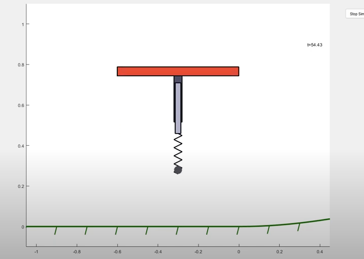
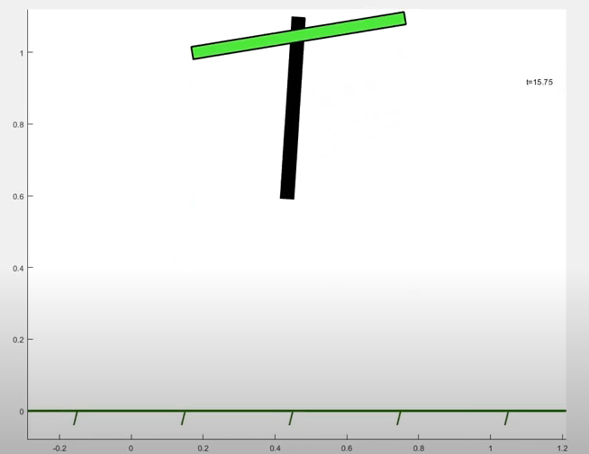
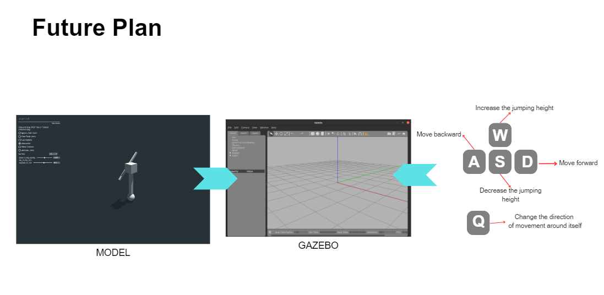

# Spring-Driven Motion in One-Legged Robots

This document serves as a detailed explanation of the Jump Simulation program, which models a jumping robot with a tail mechanism for stability. The simulation involves phases of flight, contact, and stance, modeled using physical principles like dynamics and Lagrangian mechanics. Additionally, a graphical user interface (GUI) is provided to integrate all simulations into a single tool.

## Table of Contents

1. [Overview](#overview)
2. [Dependencies](#dependencies)
3. [Class and Parameters](#class-and-parameters)
4. [Functions Breakdown](#functions-breakdown)
   - Contact, Release, and Apex Conditions
   - Dynamics of Flight, Stance, and Tail Control
   - State Update During Phases
5. [Equations and Concepts](#equations-and-concepts)
   - Lagrangian Mechanics
   - Euler-Lagrange Equations
   - Dynamics of Jump
   - Tail Control and Kinematics
   - Phase Transitions
   - Combined Dynamics: Torque and Tail Control
   - Eigenvalues and Stability Analysis
6. [Simulation Files and Features](#simulation-files-and-features)
   - jump_with_damp.py
   - jump_with_spring_cross_wall.py
   - jump_with_spring_height.py
   - jump_with_spring_theta.py
   - jump_with_spring_torque.py
   - jump_wth_spring_theta_torque.py
   - GUI.py
7. [Animation and Visualization](#animation-and-visualization)
8. [Usage Instructions](#usage-instructions)

## Overview

The objective of this simulation is to model the movement of a jumping robot using a spring mechanism and a stabilizing tail. The robot goes through several stages including flight, contact, stance, and apex. This simulation accounts for real physical phenomena like damping, spring propulsion, wall interaction, and torque application. 

A GUI is provided to combine and interact with individual simulations easily.

## Dependencies

The following libraries are required for the simulation:

- `sympy` for symbolic mathematics.
- `numpy` for numerical calculations.
- `matplotlib` for visualization.
- `scipy` for numerical integration.
- `tkinter` for graphical user input.

To install the necessary dependencies, you can use the following command:

```bash
pip install numpy sympy scipy matplotlib
```

## Class and Parameters

The `Params` class defines the parameters of the robot and environment. It includes physical constants like gravity, mass, spring stiffness, and tail length, among others. Each simulation file customizes these parameters as needed.


## Functions Breakdown

### Contact, Release, and Apex Conditions

Each simulation models three key phases:
1. **Contact**: When the foot first touches the ground.
2. **Release**: When the spring returns to its natural length.
3. **Apex**: The highest point of the jump.

### Dynamics of Flight, Stance, and Tail Control

The simulation separates the robot's motion into phases:
- **Flight**: Governs the motion during free fall using equations of motion.
- **Stance**: Models the interaction of the spring with the ground.
- **Tail Control**: A PD controller adjusts the tail's position to stabilize the jump.

### State Update During Phases

State transitions occur based on event detection using `solve_ivp`. Conditions like `y_dot = 0` (apex) or `l = l0` (release) trigger these transitions.


## Equations and Concepts

The simulation relies on **Lagrangian mechanics**, **energy principles**, and **control systems** to model the dynamics and stabilization of the robot.

### Lagrangian Mechanics

The **Lagrangian** ( $L$ ) is the fundamental equation used to derive the dynamics of the robot. It is expressed as the difference between the kinetic energy ( $T$ ) and potential energy ( $V$ ):

$$
L = T - V
$$

#### Kinetic Energy ( $T$ )

The kinetic energy is derived from the velocities of the robot in both horizontal and vertical directions:

$$
T = \frac{1}{2} m (\dot{x}^2 + \dot{y}^2)
$$

where:
- $m$ is the mass of the robot,
- $\dot{x}$ is the horizontal velocity,
- $\dot{y}$ is the vertical velocity.

#### Potential Energy ( $V$ )

The potential energy accounts for both the gravitational energy and the energy stored in the spring during compression:

$$
V = mgy + \frac{1}{2} k (l - l_0)^2
$$

where:
- $g$ is the gravitational acceleration,
- $y$ is the height of the robot,
- $k$ is the spring stiffness,
- $l$ is the current length of the spring,
- $l_0$ is the natural length of the spring.

### Euler-Lagrange Equations

The **Euler-Lagrange** equation is used to derive the equations of motion for the system:

$$
\frac{d}{dt} \left( \frac{\partial L}{\partial \dot{q}} \right) - \frac{\partial L}{\partial q} = 0
$$

where:
- $q$ represents the generalized coordinates, such as $x$ and $y$,
- $\dot{q}$ represents the velocities of those coordinates.

From this equation, the accelerations $\ddot{x}$ and $\ddot{y}$ are determined:

$$
\ddot{x} = f_x(x, y, \dot{x}, \dot{y})
$$

$$
\ddot{y} = f_y(x, y, \dot{x}, \dot{y})
$$

These accelerations are used to simulate the robot’s motion during each phase of its jump.

### Dynamics of Jump

The dynamics of the jump involve **damping**, **torque generation**, and **phase transitions**. 

#### Adjusting Damping

Damping is applied dynamically during the jump to absorb impact forces and stabilize motion. The damping coefficient $c$ is calculated as:

$$
c = c_{\text{base}} + c_{\text{gain}} \cdot |\dot{y}|
$$

where:
- $c_{\text{base}}$ is the base damping coefficient,
- $c_{\text{gain}}$ is a gain factor that increases damping for higher velocities,
- $\dot{y}$ is the vertical velocity during landing.

This ensures that high-speed impacts are absorbed smoothly.

#### Torque Calculation

To achieve a desired jump height, the torque required to compress the spring is calculated as follows:

1. Calculate the required energy to reach the target height:

$$
E_{\text{required}} = m g h_{\text{desired}}
$$

3. Determine the spring compression distance ( $\Delta l$ ):

$$
\Delta l = \sqrt{\frac{2 E_{\text{required}}}{k}}
$$

5. Calculate the spring force ( $F$ ):

$$
F = k \Delta l
$$

7. Calculate the torque ( $\tau$ ):

$$
\tau = F \cdot r
$$

where:
- $r$ is the radius of the pulley.

These calculations ensure that the robot compresses the spring optimally to achieve the desired height.


### Tail Control and Kinematics

#### Kinematics of the Tail

**Forward Kinematics** determines the end position of the tail based on its angle ( $\theta$ ):

$$
x_{\text{end}} = x + l_{\text{tail}} \sin(\theta)
$$

$$
y_{\text{end}} = y - l_{\text{tail}} \cos(\theta)
$$

where:
- $l_{\text{tail}}$ is the length of the tail,
- $x, y$ are the coordinates of the robot’s hip.

**Inverse Kinematics** calculates the required tail angle to stabilize the robot by reaching a target position:

$$
\theta_{\text{desired}} = \arctan\left(\frac{x_{\text{target}} - x}{y_{\text{target}} - y}\right)
$$

#### PD Control of the Tail

A **Proportional-Derivative (PD) Controller** adjusts the tail angle to maintain balance. The control torque ( $\tau_{\text{tail}}$ ) is calculated as:

$$
\tau_{\text{tail}} = k_p (\theta_{\text{desired}} - \theta) - k_d \cdot \dot{\theta}
$$

where:
- $\theta_{\text{desired}}$ is the desired tail angle,
- $\theta$ is the current tail angle,
- $\dot{\theta}$ is the angular velocity of the tail,
- $k_p$ is the proportional gain,
- $k_d$ is the derivative gain.

This torque helps stabilize the robot by countering imbalances during the jump.

### Phase Transitions

The simulation models three key phases:

1. **Flight Phase**:
   - Governs motion during free fall using equations of motion.
   - Drag forces are applied to account for air resistance.

2. **Contact Phase**:
   - Simulates the compression of the spring when the foot contacts the ground.
   - Transition occurs when $y \leq l_0 \cos(\theta)$.

3. **Apex Phase**:
   - Detects the highest point of the jump when $\dot{y} = 0$.

### Combined Dynamics: Torque and Tail Control

The file `jump_wth_spring_theta_torque.py` combines the torque required for propulsion with tail stabilization for optimal jump performance. This integration ensures both vertical and angular stability during motion.

### Eigenvalues and Stability Analysis

To analyze the stability of the system, eigenvalues are calculated from the system's linearized dynamics matrix $A$. These eigenvalues help determine whether the system is stable (eigenvalues with negative real parts) or unstable (eigenvalues with positive real parts).

1. **Dynamics Representation**  
   The system is expressed in state-space form:

$$
\dot{X} = A X + B U
$$

   where:
   - $X$ is the state vector (e.g., $[x, y, \dot{x}, \dot{y}, \theta_{\text{tail}}, \dot{\theta}_{\text{tail}}]$),
   - $A$ is the Jacobian matrix of the system derived from the equations of motion,
   - $B$ is the input matrix.

2. **Jacobian Matrix Calculation**  
   The Jacobian matrix $A$ is calculated from the equations of motion (EOM) using **Lagrangian mechanics**:

$$
A = \frac{\partial F}{\partial X}
$$

   where $F$ represents the dynamics equations. This is computed numerically or symbolically using:

   - sympy.Matrix.jacobian() for symbolic derivation,
   - numpy.linalg.eig() for eigenvalue computation.

3. **Eigenvalue Interpretation**  
   After computing $A$, eigenvalues $\lambda$ are derived to evaluate the stability:

   - $\text{Re}(\lambda) < 0$: Stable.
   - $\text{Re}(\lambda) > 0$: Unstable.

   This analysis provides insight into whether the robot's motion will converge to a stable equilibrium or diverge.

## Simulation Files and Features

### **1. jump_with_damp.py**
- **Purpose**: Models damping effects during the jump.
- **Key Features**:
  - Adjusts damping coefficient dynamically based on landing velocity.
  - Focuses on smooth landing and jump transitions.
  
https://github.com/user-attachments/assets/4a6fd8a1-35d7-4021-9315-fea6ef564dad

### **2. jump_with_spring_cross_wall.py**
- **Purpose**: Simulates wall interaction during a jump.
- **Key Features**:
  - Includes calculations for overcoming a wall of specified height and position.
  - Incorporates **Eigenvalue Analysis** to evaluate stability during wall interaction.
  - Useful for testing horizontal propulsion and obstacle handling.

https://github.com/user-attachments/assets/b80f6389-22a9-4660-87f0-803b318bffcf

### **3. jump_with_spring_height.py**
- **Purpose**: Calculates the required torque to achieve a target jump height.
- **Key Features**:
  - Uses energy-based calculations to determine spring compression.
  - Focuses on vertical motion and height dynamics.
  
https://github.com/user-attachments/assets/f620ad46-1763-4433-b1a0-239989a1f867

### **4. jump_with_spring_theta.py**
- **Purpose**: Focuses on controlling the jump angle $(\theta)$.
- **Key Features**:
  - Adjusts $\theta$ to stabilize the robot during landing and takeoff.
  
https://github.com/user-attachments/assets/a5607620-0e06-4c8a-b2ed-8c560587a459

### **5. jump_with_spring_torque.py**
- **Purpose**: Focuses on torque application for jumping.
- **Key Features**:
  - Models spring compression and the resulting torque for propulsion.
  
https://github.com/user-attachments/assets/1cadf9be-3f87-44d1-9f6e-2d518d237604

### **6. jump_wth_spring_theta_torque.py**
- **Purpose**: Combines $\theta$ control and torque dynamics.
- **Key Features**:
  - Integrates angular and torque considerations for optimal stability and jump performance.
  
https://github.com/user-attachments/assets/d8771cfe-afad-495e-9b67-dd5db6a37d7e

### **7. GUI.py**
- **Purpose**: Provides a graphical interface to interact with all simulations.
- **Key Features**:
  - Allows users to select and run simulations interactively.
  - Combines tools from other files into a single application.
  - Provides parameter control such as jump height, damping, and angle $(\theta)$ through a user-friendly interface.
  
https://github.com/user-attachments/assets/b53f7542-5567-4776-95e2-2aba16af2897

## Animation and Visualization

The animation visualizes the jump phases and dynamics:
- **Robot Movement**: Displays foot, hip, and tail motion.
- **Stability Control**: Shows tail adjustments using PD control.
- **Obstacle Interaction**: Illustrates wall crossing (if applicable).

## Usage Instructions

1. **Run Individual Simulations**:
   Each simulation file can be executed independently for specific features.

   ```bash
   python jump_with_damp.py
   ```

2. **Use the GUI**:
   To interact with all simulations via a single interface, run the GUI:

   ```bash
   python GUI.py
   ```

3. **Input Parameters**:
   - Enter the desired jump height in the dialog box.
   - View results like required torque and spring compression in the message box.

4. **Output**:
   - Animations visualize the motion.
   - Terminal displays computed values for debugging and analysis.

## Project Implementation Overview
We have modified the provided 6-DOF HopperSim model to a simplified 3-DOF version, focusing on reducing complexity while maintaining essential functionality. Our simulation operates on flat ground with no terrain variations. Instead of starting with continuous hopping, our approach begins by applying a calculated jumping force to achieve a specific height input, followed by a controlled descent to ensure the robot maintains balance upon landing.

Application of Kinematics
Building on the kinematics knowledge gained from our coursework, we integrated principles to enable the robot to jump to a desired height based on input parameters and return to a balanced state after landing. The model leverages inverse kinematics to compute joint configurations necessary to achieve the desired trajectory, while forward kinematics validates the robot's position during the motion. This ensures that the jump height and landing balance are dynamically adjusted in real-time.
Source Code Reference
The base model was adapted from the HopperSim project repository, available at: https://github.com/lothas/HopperSim.git.

By combining the foundational HopperSim model with our kinematic applications, we aim to enhance the robot's controlled motion for achieving specific performance objectives in jumping and balancing.
<p align="center">
  click picture to Watch the video : Original Project on Youtube
</p>
<p align="center">
  <a href="https://youtu.be/wzC50ONPQPE">
    
  </a>
</p>

<p align="center">
  click picture to Watch the video : Our Implementation Project on Youtube
</p>
<p align="center">

<p align="center">
  <a href="https://youtu.be/8rI8XFj2Hz8">
    
  </a>
</p>


## Summary

This simulation package provides a modular approach to modeling and visualizing one-legged robot dynamics. Each file targets specific aspects of the motion, while the GUI serves as an integration point for user interaction.

## Future Plan
Our future goal is to develop a one-legged jumping robot capable of moving in a 3D plane. The robot will accept inputs for jump height and direction through a custom-designed controller simulated in the system. The entire implementation, including the robot's motion and control system, will be simulated in Gazebo to ensure realistic testing and performance evaluation.
